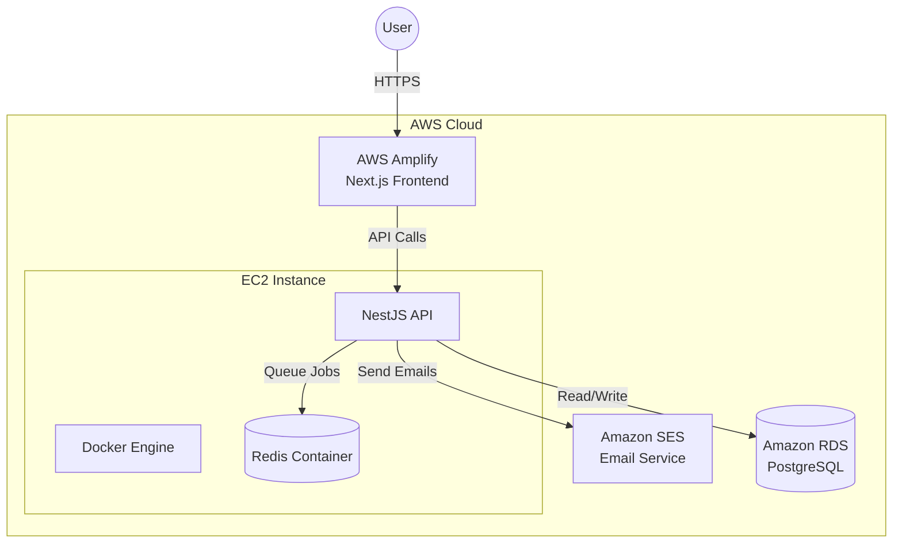

# Birthday Wheel 🎡

A production-ready full-stack application for interactive prize drawings. It features QR-code based participation, real-time physics-based spinning animations, and automated prize distribution via AWS SES.

> **Project Origin:** This project was developed based on a real freelance demand posted on [Workana](https://www.workana.com/job/desenvolvimento-de-roleta-de-aniversario-interativa-com-qr-code-e-gamificacao?ref=projects_2). The goal was to create a gamified experience to engage users and collect data efficiently, including QR redirection, lead capture forms, and automated email rewards.


## 🏗 Architecture & Tech Stack

The project leverages a robust AWS infrastructure orchestrated via Terraform, ensuring high availability.

### **Backend (NestJS)**

- **Runtime:** Node.js 22 (Alpine Linux)
- **Framework:** NestJS 11 (Modular Architecture)
- **Database:** PostgreSQL 16 (Managed via Prisma ORM)
- **Queue System:** BullMQ + Redis 7 (Asynchronous email processing & reliability)
- **Email:** AWS SES (Production) / Mailhog (Development)
- **Testing:** Jest (Unit & E2E)
- **Docs:** Swagger/OpenAPI

### **Frontend (Next.js)**

- **Framework:** Next.js 16 (App Router)
- **Styling:** Tailwind CSS + Shadcn/ui
- **State Management:** Zustand
- **Animations:** Framer Motion + Canvas Confetti (Physics-based)

### **Infrastructure (AWS + Terraform)**

- **IaC:** Terraform (State stored in S3 + DynamoDB Locking)
- **Compute:** AWS EC2 (Hosting Backend + Redis via Docker)
- **Database:** AWS RDS PostgreSQL
- **Frontend Hosting:** AWS Amplify (CI/CD & Global CDN)
- **Containerization:** Docker & Docker Compose

---

## 📐 System Architecture



## 🔄 Business Logic Flow

Understanding the lifecycle of a user interaction:

- **QR Generation:** Admins generate unique, cryptographically secure QR Tokens linked to specific stores or events.
- **Scan & Validate:** The user scans the QR code. The system validates the token's active status and expiration before allowing entry.
- **Registration:** The user inputs their details (Name, Email, Phone). The system performs an "Upsert" operation to avoid duplicates while updating contact info.
- **The Spin:** The frontend requests a spin result. The backend calculates the prize based on defined probabilities (RNG), commits the result to the database, and returns the prize ID to the frontend.
- **Animation:** The frontend receives the result before the wheel stops, calculating the exact rotation to land on the correct segment visually.
- **Async Notification:** Upon winning, a job is pushed to the Redis Queue. The worker picks up the job and sends a transactional email via AWS SES.

## 📂 Project Structure

A monorepo-style structure organized for clarity and separation of concerns.

```
birthday-wheel/
├── birthday-wheel-backend/  # NestJS API (Monolith)
│   ├── src/
│   │   ├── auth/            # JWT Strategy & Guards
│   │   ├── email/           # BullMQ Consumers & Templates
│   │   ├── prizes/          # Prize Management Logic
│   │   ├── qrtoken/         # Token Generation
│   │   └── sessions/        # Game Logic & Validation
│   ├── test/                # Jest E2E Tests
│   └── Dockerfile           # Multi-stage build
│
├── frontend/                # Next.js 16 App
│   ├── src/
│   │   ├── app/             # App Router Pages
│   │   ├── components/      # Reusable Shadcn UI
│   │   ├── store/           # Zustand State
│   │   └── services/        # API Integration
│
├── infra/                   # Infrastructure as Code
│   ├── main.tf              # AWS Resources (EC2, RDS, Amplify, IAM)
│   └── user_data.sh         # EC2 Bootstrapping Script
│
├── docker/                  # Docker Configuration
│   ├── docker-compose.dev.yaml
│   └── docker-compose.prod.yaml
```

## 🛡️ Security Highlights

**Infrastructure:**

- **VPC Isolation:** RDS Database allows connections only from the EC2 Security Group.
- **State Locking:** Terraform State is encrypted in S3 and locked via DynamoDB to prevent race conditions during deployments.

**Application:**

- **Strict Types:** End-to-end type safety with TypeScript and DTO validation (Zod & Class Validator).
- **Rate Limiting:** Backend prevents spam spins via session validation.
- **Email Security:** AWS SES uses DKIM & SPF authentication to ensure high deliverability and prevent spoofing.

## ☁️ Deployment Strategy

### Frontend (AWS Amplify)

- **Platform:** WEB_COMPUTE (Next.js SSR support).
- **Process:** Automatically detects pushes to main, builds the application, and deploys to CloudFront Edge locations.

### Backend (EC2 + Docker)

- **Hosting:** The backend runs inside a Docker container orchestrated by Docker Compose on an AWS EC2 instance.
- **Bootstrapping:** A user_data.sh script automatically installs Docker, Git, and pulls the repository upon instance creation, setting up environment variables injected securely via Terraform.

## ⚡ How to Run Locally

### 1. Start Infrastructure Services

Run PostgreSQL, Redis, and Mailhog using Docker Compose:

```bash
cd docker
docker-compose -f docker-compose.dev.yaml up -d
```

- **Mailhog (Email Testing):** http://localhost:8025
- **Redis Commander:** http://localhost:8081

### 2. Backend Setup

```bash
cd birthday-wheel-backend
npm install
npx prisma migrate dev
npm run start:dev
```

- **API:** http://localhost:3000
- **Swagger Docs:** http://localhost:3000/api/docs

### 3. Frontend Setup

```bash
cd frontend
npm install
npm run dev
```

## 🧪 Testing

The project uses Jest for a comprehensive testing strategy.

### Unit Tests

Covers individual services, controllers, and business logic isolated from dependencies.

```bash
cd birthday-wheel-backend
npm run test
```

### End-to-End (E2E) Tests

Validates the full application flow (HTTP Request -> Controller -> Database -> Response).

```bash
npm run test:e2e
```

### Test Coverage

Generates a detailed report of code coverage.

```bash
npm run test:cov
```

## 📄 License

This project is licensed under the MIT License.
